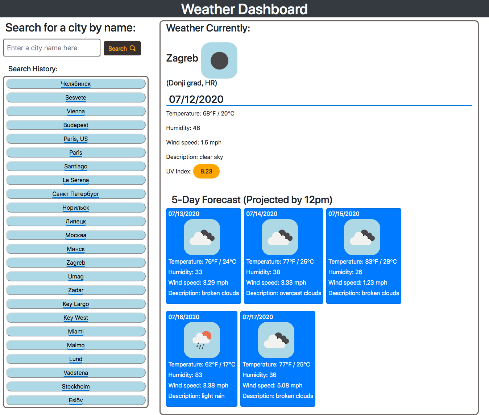

# Weather Dashboard

## Deployment Link
https://dj-viking.github.io/weather-dashboard/

## Description

* This application displays the weather forecast for the current day in the particular city searched.

- (may have to specify which country in this format as some cities have same names in different countries: Paris, US for the city Paris in the state of Texas, searching Paris defaults to Paris, FR). 

* Also displays the projected 5-day forecast by 12pm of that given day. 

* The search history will be displayed on the left hand side. The search history persists after reloading the page or closing and reopening the browser in which the page was loaded on. If loading the page from a different place in the same browser the local storage will be empty for that given location in which the page was loaded. 

* This page is scaled to work on phones as well as desktop screens for a wide range of resolutions.

* Also supports Cyrillic or other alphabet inputs in the search field! I wonder how many languages the open weather API can detect?

## Technologies Used
- HTML5
- CSS3 custom, and Twitter Bootstrap Library
- Javascript, Vanilla Library and Moment.js Library

## Screenshot

